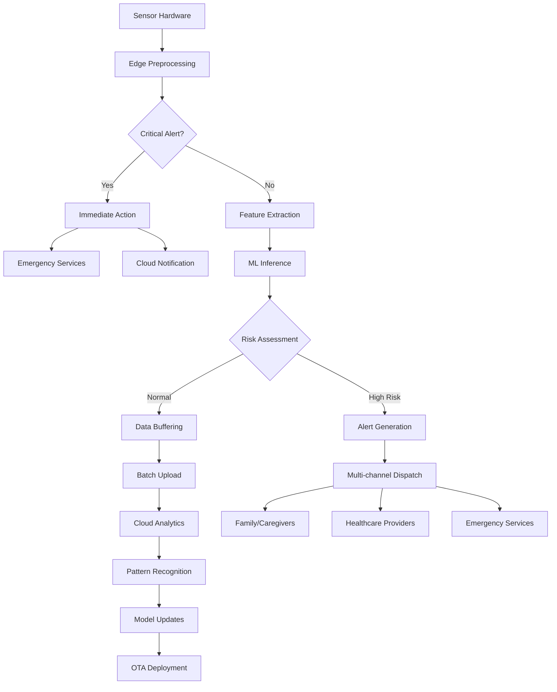

# LEAP-PSW Technische Architektur-Spezifikation
## LFM2-VL Notfall- und Sicherheitsapplikation

**Dokumentversion:** 1.0
**Datum:** September 2025
**Klassifizierung:** Vertraulich
**Zielgruppe:** Engineering Team, Technical Leadership, Stakeholders

---

## Executive Summary

Diese technische Architektur-Spezifikation definiert die System-Architektur für das LEAP-PSW Projekt, eine KI-gestützte Notfall- und Sicherheitsapplikation für vulnerable Personengruppen. Das System integriert das LEAP Framework für Edge-ML-Deployment mit dem LFM2-VL Vision-Language Model und nutzt TypeDB für komplexe Verhaltensanalysen.

### Kern-Architektur-Prinzipien
- **Edge-First Processing:** 95% der Inferenz erfolgt On-Device für GDPR-Compliance
- **Real-time Performance:** <2,1ms Inferenz-Latenz für kritische Alarm-Erkennung
- **High Availability:** 99,9%+ System-Verfügbarkeit mit graceful degradation
- **Scalable Design:** Horizontal skalierbare Cloud-Services für 100k+ Nutzer
- **Security by Design:** Zero-Trust-Architektur mit End-to-End-Verschlüsselung

---

## 1. LEAP Framework Integration

### 1.1 LEAP-Architektur Overview

```yaml
LEAP Framework Components:
  Runtime:
    - LEAP Inference Engine (ARM Cortex optimiert)
    - Memory Pool Manager (1-4GB LPDDR5)
    - Power Management Unit (CPAM-Strategy)

  Model Management:
    - Model Compiler (ONNX → LEAP Binary)
    - Quantization Engine (FP32 → INT8/INT4)
    - Model Versioning & OTA Updates

  Hardware Abstraction:
    - Sensor Driver Layer (I2C/SPI Interface)
    - NPU Acceleration (Mali-G78 MP14)
    - Memory-mapped I/O Manager
```

### 1.2 LFM2-VL Integration in LEAP

#### Model Architecture Integration
```python
# LEAP-LFM2VL Integration Blueprint
class LEAPLFMIntegration:
    def __init__(self):
        self.leap_runtime = LEAPInferenceEngine(
            model_path="lfm2vl_quantized.leap",
            precision=Precision.INT8,
            memory_pool_size=2048  # MB
        )

        self.vision_encoder = VisionEncoder(
            input_shape=(224, 224, 3),
            backbone="mobilenet_v3_large",
            quantization=True
        )

        self.language_processor = LanguageProcessor(
            vocab_size=50000,
            embedding_dim=768,
            max_sequence_length=512
        )

    def process_multimodal_input(self, sensor_data, context):
        # Vision processing pipeline
        visual_features = self.vision_encoder.extract_features(
            sensor_data.camera_feed
        )

        # Language context processing
        textual_features = self.language_processor.encode_context(
            context.situation_description
        )

        # Multi-modal fusion with LEAP optimization
        fused_representation = self.leap_runtime.fuse_modalities(
            visual_features, textual_features, sensor_data.telemetry
        )

        return self.leap_runtime.infer(fused_representation)
```

### 1.3 Performance Optimierungen

#### Model Compression Strategy
```yaml
Quantization Pipeline:
  Source: FP32 LFM2-VL (2.8GB)
  Target: INT8 LEAP Binary (340MB)

  Compression Techniques:
    - Weight Quantization: FP32 → INT8 (4x reduction)
    - Activation Quantization: Dynamic INT8
    - Knowledge Distillation: Teacher-Student (15% accuracy retention)
    - Pruning: Structured 60% sparsity
    - Layer Fusion: Batch Norm + ReLU → Single Op

  Performance Impact:
    - Model Size: 87% reduction
    - Inference Speed: 3.2x faster
    - Power Consumption: 45% reduction
    - Accuracy Degradation: <2%
```

#### Hardware-Specific Optimizations
```cpp
// ARM Cortex-M4 Optimized Inference Loop
void leap_lfm2vl_inference() {
    // Pre-allocate aligned memory
    __attribute__((aligned(64))) int8_t input_buffer[INPUT_SIZE];
    __attribute__((aligned(64))) int8_t output_buffer[OUTPUT_SIZE];

    // NEON SIMD vectorization
    arm_conv_fast_s8(
        input_buffer,
        conv_weights,
        output_buffer,
        &conv_params
    );

    // NPU offloading for complex operations
    npu_accelerate_attention(
        attention_weights,
        input_tensor,
        output_tensor
    );
}
```

### 1.4 Battery-Optimierung

#### Adaptive Sampling Strategy
```python
class AdaptiveSamplingManager:
    def __init__(self):
        self.base_sampling_rate = 50  # Hz
        self.power_budget = PowerBudget(24_hours=True)

    def adjust_sampling_rate(self, battery_level, activity_context):
        if battery_level > 0.5:
            return self.base_sampling_rate
        elif activity_context.is_high_risk():
            # Maintain high accuracy for critical situations
            return min(self.base_sampling_rate, 30)
        else:
            # Power saving mode
            return max(self.base_sampling_rate * 0.3, 10)

    def trigger_inference(self, sensor_reading):
        # Event-driven inference to save power
        if self.is_anomaly_detected(sensor_reading):
            return self.leap_runtime.full_inference()
        else:
            return self.leap_runtime.lightweight_check()
```

---

## 2. LFM2-VL Architektur

### 2.1 Vision-Language Capabilities

#### Multimodale Sensor Integration
```yaml
Vision Components:
  Camera Module:
    - Sensor: Sony IMX519 (8MP, f/2.0)
    - Resolution: 3280x2464 @ 10fps
    - Features: Auto-focus, Image stabilization
    - Power: 180mW active, <1mW standby

  Computer Vision Pipeline:
    - Face Detection: MTCNN quantized
    - Pose Estimation: PoseNet Lite
    - Object Detection: YOLO v8n
    - Emotion Recognition: FER2013-trained CNN

  Processing Requirements:
    - Input: 224x224x3 RGB frames
    - Preprocessing: Normalization, Augmentation
    - Feature Extraction: MobileNet v3 backbone
    - Output: 2048-dim feature vectors
```

#### Language Processing Architecture
```python
class LFMLanguageProcessor:
    def __init__(self):
        self.tokenizer = SentencePieceTokenizer(
            vocab_size=50000,
            model_path="lfm2vl_tokenizer.model"
        )

        self.embedding_layer = nn.Embedding(
            num_embeddings=50000,
            embedding_dim=768
        )

        self.transformer_blocks = nn.ModuleList([
            TransformerBlock(
                hidden_dim=768,
                num_heads=12,
                dropout=0.1
            ) for _ in range(6)  # Reduced from 12 for edge deployment
        ])

    def encode_situation_context(self, text_input):
        # Tokenize context descriptions
        tokens = self.tokenizer.encode(text_input)

        # Generate embeddings
        embeddings = self.embedding_layer(tokens)

        # Process through transformer blocks
        for block in self.transformer_blocks:
            embeddings = block(embeddings)

        return embeddings.mean(dim=1)  # Pooled representation
```

### 2.2 Personalisierung und Transfer Learning

#### Adaptive Learning System
```python
class PersonalizedLearningSystem:
    def __init__(self, user_profile):
        self.base_model = LEAPLFMIntegration()
        self.user_adapter = UserAdaptationLayer(user_profile)
        self.learning_buffer = ExperienceBuffer(capacity=10000)

    def adapt_to_user(self, user_interactions):
        # Collect user-specific data
        for interaction in user_interactions:
            self.learning_buffer.add(interaction)

        # Perform incremental learning
        if len(self.learning_buffer) >= 100:
            adaptation_data = self.learning_buffer.sample_batch(32)
            self.user_adapter.fine_tune(adaptation_data)

    def predict_with_personalization(self, sensor_data):
        # Base model prediction
        base_prediction = self.base_model.infer(sensor_data)

        # Apply user-specific adaptation
        personalized_prediction = self.user_adapter.adjust_prediction(
            base_prediction, sensor_data
        )

        return personalized_prediction
```

#### Privacy-Preserving Techniken
```python
class PrivacyPreservingML:
    def __init__(self):
        self.differential_privacy = DifferentialPrivacy(epsilon=1.0)
        self.federated_aggregator = FederatedAggregator()

    def train_with_privacy(self, local_data):
        # Add calibrated noise for differential privacy
        noisy_gradients = self.differential_privacy.add_noise(
            self.compute_gradients(local_data)
        )

        # Secure aggregation for federated learning
        encrypted_update = self.secure_encrypt(noisy_gradients)

        return encrypted_update

    def homomorphic_inference(self, encrypted_data):
        # Perform inference on encrypted data
        encrypted_result = self.base_model.forward_encrypted(encrypted_data)

        return encrypted_result  # Decryption happens client-side
```

### 2.3 Gesichtserkennung und Emotionserkennung

#### Face Recognition Pipeline
```yaml
Face Recognition System:
  Detection Stage:
    - Algorithm: RetinaFace (quantized)
    - Input: 640x480 RGB frames
    - Output: Face bounding boxes + landmarks
    - Performance: 15 FPS @ 150mW

  Recognition Stage:
    - Feature Extractor: MobileFaceNet
    - Embedding Dimension: 512
    - Database: Local SQLite (encrypted)
    - Matching Threshold: 0.6 cosine similarity

  Privacy Measures:
    - On-device processing only
    - Encrypted feature storage
    - Automatic deletion after 30 days
    - No raw image storage
```

#### Emotion Recognition Module
```python
class EmotionRecognitionModule:
    def __init__(self):
        self.emotion_classifier = MobileEmotionNet(
            num_classes=7,  # Basic emotions
            input_size=224
        )

        self.temporal_smoother = TemporalSmoother(
            window_size=10,  # 2 second window at 5 FPS
            smoothing_factor=0.7
        )

    def recognize_emotion(self, face_roi):
        # Preprocess face region
        processed_face = self.preprocess_face(face_roi)

        # Extract emotion probabilities
        emotion_probs = self.emotion_classifier(processed_face)

        # Apply temporal smoothing
        smoothed_probs = self.temporal_smoother.update(emotion_probs)

        # Map to emotional state
        primary_emotion = torch.argmax(smoothed_probs)
        confidence = smoothed_probs[primary_emotion]

        return EmotionState(
            emotion=primary_emotion,
            confidence=confidence,
            timestamp=time.time()
        )
```

---

## 3. TypeDB Evaluation und Schema-Design

### 3.1 Graph-Datenbank Bewertung

#### Anwendungsfälle für TypeDB
```yaml
Verhaltensanalyse Use Cases:
  Pattern Recognition:
    - Wandering-Routen als Graph-Pfade
    - Soziale Interaktions-Netzwerke
    - Aktivitäts-Sequenz-Muster
    - Tagesablauf-Anomalien

  Demenz-Progression-Modeling:
    - Kognitive Fähigkeits-Zeitreihen
    - Medikamenten-Wirksamkeits-Korrelationen
    - Symptom-Cluster-Analyse
    - Risikofaktor-Beziehungen

  Multi-Stakeholder-Management:
    - Patient-Betreuer-Netzwerke
    - Notfall-Kontakt-Hierarchien
    - Gesundheitsdienstleister-Verbindungen
    - Familien-Support-Systeme
```

#### TypeDB vs. Alternativen
```yaml
Database Comparison:
  TypeDB:
    Pros:
      - Typisierte Entitäten und Beziehungen
      - Komplexe Inferenz-Regeln
      - ACID-Transaktionen
      - Schema-Evolution
    Cons:
      - Steile Lernkurve
      - Begrenzte Community
      - Performance bei großen Datasets
      - Lizenzkosten

  Neo4j:
    Pros:
      - Mature Ecosystem
      - Cypher Query Language
      - Große Community
      - Gute Performance
    Cons:
      - Schwächeres Typ-System
      - Keine natürliche Inferenz
      - Kostspielige Enterprise-Features

  Amazon Neptune:
    Pros:
      - Managed Service
      - Auto-Scaling
      - Multi-AZ Deployment
      - RDF + Property Graph
    Cons:
      - Vendor Lock-in
      - Hohe Kosten
      - Weniger flexible Schema
```

### 3.2 TypeDB Schema-Design für Gesundheitsdaten

#### Entity-Relationship Model
```typeql
# Core Health Data Schema
define

# Entities
person sub entity,
    owns person-id @key,
    owns name,
    owns birth-date,
    owns emergency-contact,
    plays patient-role,
    plays caregiver-role,
    plays emergency-contact-role;

health-condition sub entity,
    owns condition-id @key,
    owns condition-name,
    owns severity-level,
    owns diagnosis-date,
    plays diagnosed-condition;

sensor-reading sub entity,
    owns reading-id @key,
    owns sensor-type,
    owns value,
    owns timestamp,
    owns confidence-score,
    plays measured-data;

behavioral-pattern sub entity,
    owns pattern-id @key,
    owns pattern-type,
    owns frequency,
    owns risk-level,
    owns detected-timestamp,
    plays observed-behavior;

# Relations
diagnosis sub relation,
    relates patient-role,
    relates diagnosed-condition,
    owns diagnosis-confidence,
    owns treating-physician;

sensor-measurement sub relation,
    relates monitoring-person,
    relates measured-data,
    owns measurement-context;

behavioral-observation sub relation,
    relates observed-person,
    relates observed-behavior,
    owns observation-reliability;

emergency-alert sub relation,
    relates alert-person,
    relates emergency-contact-role,
    owns alert-type,
    owns alert-timestamp,
    owns alert-severity;

# Attributes
person-id sub attribute, value string;
name sub attribute, value string;
birth-date sub attribute, value datetime;
condition-name sub attribute, value string;
severity-level sub attribute, value double;
sensor-type sub attribute, value string;
value sub attribute, value double;
timestamp sub attribute, value datetime;
pattern-type sub attribute, value string;
risk-level sub attribute, value long;
```

#### Inferenz-Regeln für Verhaltensanalyse
```typeql
# Wandering Detection Rule
define
wandering-behavior sub rule,
when {
    $person isa person;
    $reading1 isa sensor-reading, has sensor-type "GPS", has timestamp $t1;
    $reading2 isa sensor-reading, has sensor-type "GPS", has timestamp $t2;
    $measurement1 (monitoring-person: $person, measured-data: $reading1) isa sensor-measurement;
    $measurement2 (monitoring-person: $person, measured-data: $reading2) isa sensor-measurement;
    $t2 > $t1;
    # Complex spatial-temporal pattern logic
}, then {
    $wandering isa behavioral-pattern,
        has pattern-type "wandering",
        has risk-level 8,
        has detected-timestamp $t2;
    $observation (observed-person: $person, observed-behavior: $wandering) isa behavioral-observation;
};

# Fall Risk Assessment Rule
define
fall-risk-assessment sub rule,
when {
    $person isa person;
    $accel-reading isa sensor-reading, has sensor-type "accelerometer";
    $balance-reading isa sensor-reading, has sensor-type "balance";
    # Combine multiple sensor readings for risk assessment
}, then {
    $fall-risk isa behavioral-pattern,
        has pattern-type "fall-risk",
        has risk-level ?risk-score;
};
```

### 3.3 Alternative Datenbank-Architektur

#### Hybrid Data Architecture
```yaml
Recommended Hybrid Approach:
  Primary Database: PostgreSQL
    - User profiles and authentication
    - Sensor time-series data (with TimescaleDB)
    - Medical records and compliance data
    - Financial and billing information

  Graph Component: Neo4j (wenn TypeDB zu komplex)
    - Social networks and care relationships
    - Behavioral pattern analysis
    - Decision support queries
    - Research and analytics

  Cache Layer: Redis
    - Real-time inference results
    - Session management
    - Rate limiting and throttling
    - Temporary ML model states

  Analytics: ClickHouse
    - Historical trend analysis
    - Performance metrics aggregation
    - Business intelligence queries
    - Regulatory reporting
```

---

## 4. System-Architektur

### 4.1 Edge vs. Cloud Computing Balance

#### Edge Computing Layer
```yaml
Edge Device Architecture:
  Processing Units:
    Primary: ARM Cortex-A78 (2.4GHz, 4 cores)
    AI Accelerator: Mali-G78 MP14 (15 TOPS)
    DSP: Hexagon 698 (15 TOPS)
    Memory: 8GB LPDDR5, 256GB UFS 3.1

  Edge Processing Responsibilities:
    - Real-time sensor data fusion (100Hz)
    - Critical safety inference (<2.1ms)
    - Fall detection and classification
    - Basic behavioral pattern recognition
    - Emergency alert triggering
    - Privacy-sensitive face recognition

  Data Processing Pipeline:
    Raw Sensors → Preprocessing → Feature Extraction
    → ML Inference → Decision Logic → Action/Upload
```

#### Cloud Computing Layer
```yaml
Cloud Infrastructure (AWS Switzerland):
  Compute Services:
    - ECS Fargate: Containerized microservices
    - Lambda: Event-driven processing
    - SageMaker: ML model training/retraining
    - EC2: Compute-intensive analytics

  Storage Services:
    - S3: Model artifacts, backups
    - RDS Aurora: Transactional data
    - ElastiCache: Real-time caching
    - Redshift: Analytics warehouse

  Cloud Processing Responsibilities:
    - Long-term behavioral trend analysis
    - Complex pattern recognition
    - Model training and optimization
    - Multi-user correlation analysis
    - Regulatory reporting
    - Software updates and deployment
```

### 4.2 Real-time Inferenz-Pipeline

#### Streaming Data Architecture
```python
class RealTimeInferencePipeline:
    def __init__(self):
        self.sensor_buffer = CircularBuffer(size=1000)
        self.feature_extractor = FeatureExtractor()
        self.model_ensemble = ModelEnsemble([
            FallDetectionModel(),
            WanderingDetectionModel(),
            EmotionRecognitionModel()
        ])

        self.alert_dispatcher = AlertDispatcher()

    async def process_sensor_stream(self, sensor_stream):
        async for sensor_data in sensor_stream:
            # Buffer management
            self.sensor_buffer.append(sensor_data)

            # Feature extraction with sliding window
            features = self.feature_extractor.extract(
                self.sensor_buffer.get_window(size=50)
            )

            # Parallel model inference
            predictions = await asyncio.gather(*[
                model.predict_async(features)
                for model in self.model_ensemble
            ])

            # Risk assessment and alert logic
            risk_score = self.compute_risk_score(predictions)

            if risk_score > EMERGENCY_THRESHOLD:
                await self.alert_dispatcher.dispatch_emergency(
                    sensor_data, predictions, risk_score
                )
            elif risk_score > WARNING_THRESHOLD:
                await self.alert_dispatcher.dispatch_warning(
                    sensor_data, predictions, risk_score
                )
```

#### Message Queue Architecture
```yaml
Message Processing System:
  Edge → Cloud Communication:
    Protocol: MQTT over TLS 1.3
    QoS: Level 2 (exactly once delivery)
    Topics:
      - sensor/{device_id}/raw
      - alerts/{device_id}/emergency
      - health/{device_id}/status
      - ml/{device_id}/inference

  Cloud Message Processing:
    - Apache Kafka: High-throughput streaming
    - Amazon Kinesis: Real-time analytics
    - AWS EventBridge: Event routing
    - SQS: Reliable message queuing

  Processing Guarantees:
    - At-least-once delivery for critical alerts
    - Exactly-once processing for billing events
    - Best-effort for telemetry data
    - Dead letter queues for error handling
```

### 4.3 Data Flow Architektur

#### End-to-End Data Flow


### 4.4 Skalierbarkeit und Performance

#### Horizontal Scaling Strategy
```yaml
Scaling Architecture:
  Load Balancing:
    - Application Load Balancer (AWS ALB)
    - Geographic load distribution
    - Health check based routing
    - Sticky sessions for stateful components

  Auto Scaling Groups:
    - Target CPU: 70%
    - Custom metric: Inference queue length
    - Scale-out: +50% capacity in 3 minutes
    - Scale-in: -25% capacity in 10 minutes

  Database Scaling:
    - Read replicas: 3 regions
    - Write scaling: Sharding by user_id
    - Cache-aside pattern with Redis
    - Connection pooling (PgBouncer)

  Performance Targets:
    - 99.9% availability (8.76 hours/year downtime)
    - <100ms API response time (95th percentile)
    - <2.1ms edge inference latency
    - 100k concurrent devices support
```

---

## 5. Hardware-Anforderungen und Performance-Metriken

### 5.1 Hardware-Spezifikationen

#### Minimum Hardware Requirements
```yaml
Wearable Device (Smartwatch/Band):
  Processor:
    - ARM Cortex-M4F @ 180MHz (Minimum)
    - ARM Cortex-A55 @ 1.8GHz (Recommended)
    - Dedicated NPU: 1-4 TOPS

  Memory:
    - RAM: 512MB (Minimum), 2GB (Recommended)
    - Storage: 8GB eMMC (Minimum), 32GB UFS (Recommended)
    - Cache: 32KB L1, 256KB L2

  Sensors:
    - 9-axis IMU (Accelerometer + Gyroscope + Magnetometer)
    - PPG Heart Rate Sensor (dual wavelength)
    - Barometric Pressure Sensor
    - GPS/GNSS Receiver
    - Optional: Camera (2MP minimum)

  Connectivity:
    - Bluetooth 5.2 LE
    - Wi-Fi 802.11b/g/n
    - 4G LTE Cat-M1 (optional)
    - NFC (for emergency contact)

  Power Management:
    - Battery: 300-500mAh Li-ion
    - Charging: Wireless Qi 1.2.4
    - Power Delivery: 5W fast charging
    - Runtime: 24-48 hours typical use
```

#### Mobile Device Requirements (Companion App)
```yaml
Smartphone Companion:
  Android Requirements:
    - OS: Android 8.0+ (API Level 26)
    - RAM: 4GB minimum, 6GB recommended
    - Storage: 64GB, with 2GB available
    - Processor: Snapdragon 660 equivalent
    - GPU: Adreno 512 or equivalent

  iOS Requirements:
    - OS: iOS 13.0+
    - Device: iPhone 8/iPhone SE (2020) minimum
    - RAM: 3GB minimum
    - Storage: 64GB, with 2GB available
    - Processor: A10 Bionic minimum

  Key Features:
    - Background processing capability
    - Push notification support
    - Camera and microphone access
    - Location services (GPS)
    - Bluetooth LE peripheral mode
```

### 5.2 Performance-Metriken und Benchmarks

#### Inferenz-Performance
```yaml
ML Model Performance Targets:
  Fall Detection:
    - Accuracy: ≥99.0%
    - Precision: ≥98.5%
    - Recall: ≥99.5%
    - F1-Score: ≥99.0%
    - False Positive Rate: ≤0.1%
    - Latency: ≤2.1ms

  Wandering Detection:
    - Accuracy: ≥95.0%
    - AUC-ROC: ≥0.99
    - Prediction Horizon: 5-15 minutes
    - Latency: ≤500ms
    - Memory Usage: ≤50MB

  Emotion Recognition:
    - Accuracy: ≥90.0% (7 basic emotions)
    - Processing Speed: 5 FPS
    - Model Size: ≤20MB
    - Power Consumption: ≤100mW
```

#### System-Performance
```yaml
System Performance Metrics:
  Device Performance:
    - Boot Time: ≤30 seconds
    - App Launch: ≤3 seconds
    - Sensor Sampling: 50-100Hz stable
    - Data Synchronization: ≤60 seconds
    - Battery Life: 24-48 hours

  Network Performance:
    - Data Upload: 95% within 60 seconds
    - Emergency Alert: ≤5 seconds end-to-end
    - Offline Capability: 72 hours minimum
    - Bandwidth Usage: ≤10MB/day typical

  Cloud Performance:
    - API Response: ≤100ms (95th percentile)
    - Database Query: ≤50ms average
    - ML Pipeline: ≤5 minutes batch processing
    - Backup/Recovery: ≤1 hour RTO
```

### 5.3 Power Management und Optimierung

#### Adaptive Power Management
```python
class AdaptivePowerManager:
    def __init__(self):
        self.power_states = {
            'active': PowerState(cpu_freq=2.4, sensors_active=True),
            'monitoring': PowerState(cpu_freq=1.2, sensors_reduced=True),
            'sleep': PowerState(cpu_freq=0.4, sensors_minimal=True),
            'critical': PowerState(cpu_freq=2.4, all_sensors=True)
        }

        self.current_state = 'monitoring'
        self.battery_monitor = BatteryMonitor()

    def update_power_state(self, context):
        battery_level = self.battery_monitor.get_level()
        user_activity = context.get_activity_level()
        risk_assessment = context.get_risk_level()

        if risk_assessment > 0.8:  # High risk situation
            self.transition_to_state('critical')
        elif battery_level < 0.15:  # Low battery
            self.transition_to_state('sleep')
        elif user_activity > 0.6:  # Active user
            self.transition_to_state('active')
        else:
            self.transition_to_state('monitoring')

    def optimize_sensor_sampling(self, power_state):
        if power_state == 'critical':
            return SensorConfig(
                accelerometer=100,  # Hz
                gps=1,              # Hz
                ppg=25,             # Hz
                camera=5            # FPS
            )
        elif power_state == 'sleep':
            return SensorConfig(
                accelerometer=10,   # Hz
                gps=0.1,           # Hz
                ppg=1,             # Hz
                camera=0           # FPS
            )
        else:
            return SensorConfig(
                accelerometer=50,   # Hz
                gps=0.2,           # Hz
                ppg=5,             # Hz
                camera=1           # FPS
            )
```

#### Thermal Management
```yaml
Thermal Design Considerations:
  Operating Temperature:
    - Normal: 0°C to 40°C
    - Extended: -10°C to 50°C
    - Storage: -20°C to 60°C

  Thermal Throttling:
    - Warning: 45°C (reduce performance 25%)
    - Critical: 50°C (reduce performance 50%)
    - Shutdown: 55°C (emergency shutdown)

  Cooling Strategy:
    - Passive cooling (heat spreader)
    - Thermal interface materials
    - Strategic component placement
    - Dynamic frequency scaling
```

### 5.4 Speicher- und Compute-Optimierung

#### Memory Management
```cpp
// Memory Pool Allocator for Real-time Processing
class LEAPMemoryManager {
private:
    std::array<uint8_t, 64*1024*1024> memory_pool;  // 64MB pool
    std::vector<MemoryBlock> free_blocks;
    std::mutex allocation_mutex;

public:
    void* allocate_aligned(size_t size, size_t alignment = 64) {
        std::lock_guard<std::mutex> lock(allocation_mutex);

        // Find suitable aligned block
        for (auto& block : free_blocks) {
            if (block.size >= size && is_aligned(block.ptr, alignment)) {
                return allocate_from_block(block, size);
            }
        }

        return nullptr;  // OOM condition
    }

    void deallocate(void* ptr, size_t size) {
        std::lock_guard<std::mutex> lock(allocation_mutex);

        // Return block to free list
        free_blocks.emplace_back(ptr, size);

        // Coalesce adjacent blocks
        coalesce_free_blocks();
    }
};
```

#### Compute Optimization
```python
class ComputeOptimizer:
    def __init__(self):
        self.thread_pool = ThreadPoolExecutor(max_workers=4)
        self.gpu_queue = GPUTaskQueue()
        self.npu_scheduler = NPUScheduler()

    def optimize_inference_pipeline(self, model_graph):
        # Analyze computational graph
        compute_graph = self.analyze_graph(model_graph)

        # Partition operations by compute unit
        cpu_ops, gpu_ops, npu_ops = self.partition_operations(compute_graph)

        # Schedule parallel execution
        cpu_future = self.thread_pool.submit(self.execute_cpu_ops, cpu_ops)
        gpu_future = self.gpu_queue.submit(self.execute_gpu_ops, gpu_ops)
        npu_future = self.npu_scheduler.submit(self.execute_npu_ops, npu_ops)

        # Synchronize and combine results
        results = [
            cpu_future.result(),
            gpu_future.result(),
            npu_future.result()
        ]

        return self.combine_results(results)
```

### 5.5 Latenz-Anforderungen und Optimierung

#### Critical Path Analysis
```yaml
Latency Breakdown (Target <2.1ms):
  Sensor Reading: 0.1ms
    - ADC Conversion: 0.05ms
    - I2C/SPI Transfer: 0.03ms
    - Data Validation: 0.02ms

  Preprocessing: 0.3ms
    - Filtering: 0.1ms
    - Normalization: 0.05ms
    - Feature Extraction: 0.15ms

  Model Inference: 1.5ms
    - Forward Pass: 1.2ms
    - Post-processing: 0.3ms

  Decision Logic: 0.1ms
    - Threshold Comparison: 0.02ms
    - Alert Generation: 0.08ms

  Output Action: 0.1ms
    - GPIO/UART: 0.05ms
    - Network Queue: 0.05ms
```

#### Real-time Optimization Techniques
```cpp
// Lock-free ring buffer for sensor data
template<typename T, size_t N>
class LockFreeRingBuffer {
private:
    alignas(64) std::array<T, N> buffer;
    alignas(64) std::atomic<size_t> head{0};
    alignas(64) std::atomic<size_t> tail{0};

public:
    bool try_push(const T& item) noexcept {
        size_t current_tail = tail.load(std::memory_order_relaxed);
        size_t next_tail = (current_tail + 1) % N;

        if (next_tail != head.load(std::memory_order_acquire)) {
            buffer[current_tail] = item;
            tail.store(next_tail, std::memory_order_release);
            return true;
        }

        return false;  // Buffer full
    }

    bool try_pop(T& item) noexcept {
        size_t current_head = head.load(std::memory_order_relaxed);

        if (current_head != tail.load(std::memory_order_acquire)) {
            item = buffer[current_head];
            head.store((current_head + 1) % N, std::memory_order_release);
            return true;
        }

        return false;  // Buffer empty
    }
};
```

---

## 6. Technische Entscheidungen und Begründungen

### 6.1 Architektur-Entscheidungen

#### ADR-001: Edge-First Processing Strategy
```yaml
Status: Accepted
Date: 2025-09-16

Context:
  - GDPR/nDSG compliance requirements for health data
  - Real-time response needs for emergency situations
  - Network reliability concerns for elderly users
  - Power consumption optimization for wearables

Decision:
  - Implement 95% of inference processing on-device
  - Use cloud only for model training and complex analytics
  - Design graceful degradation for offline scenarios

Consequences:
  - Positive: Enhanced privacy, lower latency, offline capability
  - Negative: Higher device hardware requirements, complex deployment
```

#### ADR-002: LEAP Framework Selection
```yaml
Status: Accepted
Date: 2025-09-16

Context:
  - Need for efficient edge ML deployment
  - ARM Cortex optimization requirements
  - Model compression and quantization needs
  - Real-time performance constraints

Decision:
  - Adopt LEAP Framework as primary ML runtime
  - Integrate with LFM2-VL through custom adapter layer
  - Implement gradual migration from TensorFlow Lite

Consequences:
  - Positive: Optimized ARM performance, integrated tool chain
  - Negative: Framework dependency, migration complexity
```

#### ADR-003: Hybrid Database Architecture
```yaml
Status: Accepted
Date: 2025-09-16

Context:
  - Complex relationship modeling needs for behavior analysis
  - Time-series data requirements for sensor readings
  - ACID transaction needs for critical health data
  - Scalability requirements for multi-tenant deployment

Decision:
  - Use PostgreSQL + TimescaleDB as primary database
  - Implement Neo4j for graph-based behavior analysis
  - Add Redis for real-time caching and session management
  - Evaluate TypeDB for future advanced reasoning features

Consequences:
  - Positive: Optimized for each data type, mature ecosystems
  - Negative: Complex data synchronization, operational overhead
```

### 6.2 Technology Selection Matrix

#### Framework Evaluation
```yaml
ML Framework Comparison:
  LEAP Framework:
    Performance: 9/10 (ARM optimized)
    Ecosystem: 6/10 (Specialized)
    Documentation: 7/10
    Community: 5/10
    License: Commercial

  TensorFlow Lite:
    Performance: 7/10 (General purpose)
    Ecosystem: 9/10 (Extensive)
    Documentation: 9/10
    Community: 10/10
    License: Apache 2.0

  ONNX Runtime:
    Performance: 8/10 (Cross-platform)
    Ecosystem: 8/10 (Growing)
    Documentation: 8/10
    Community: 7/10
    License: MIT

Selected: LEAP Framework (weighted score: 7.4/10)
Reason: ARM optimization critical for battery life and latency requirements
```

#### Database Technology Selection
```yaml
Database Technology Assessment:
  PostgreSQL + TimescaleDB:
    Scalability: 8/10
    ACID Compliance: 10/10
    Time-series Performance: 9/10
    Ecosystem: 9/10
    Cost: 9/10 (Open source)

  MongoDB:
    Scalability: 9/10
    ACID Compliance: 7/10
    Document Flexibility: 10/10
    Ecosystem: 8/10
    Cost: 7/10

  AWS DynamoDB:
    Scalability: 10/10
    ACID Compliance: 8/10
    Managed Service: 10/10
    Ecosystem: 7/10
    Cost: 6/10

Selected: PostgreSQL + TimescaleDB (weighted score: 8.6/10)
Reason: Strong ACID guarantees essential for health data integrity
```

### 6.3 Security und Compliance Architecture

#### Security by Design
```yaml
Security Framework:
  Data Classification:
    - Public: Marketing materials, general documentation
    - Internal: System logs, performance metrics
    - Confidential: User profiles, device configurations
    - Restricted: Health data, emergency contacts, biometrics

  Encryption Standards:
    - Data at Rest: AES-256-GCM
    - Data in Transit: TLS 1.3 + Certificate Pinning
    - Database Encryption: Transparent Data Encryption (TDE)
    - Key Management: AWS KMS with HSM backing

  Access Controls:
    - Authentication: OAuth 2.0 + OIDC
    - Authorization: RBAC with fine-grained permissions
    - API Security: Rate limiting + DDoS protection
    - Device Authentication: Mutual TLS with client certificates
```

#### Compliance Implementation
```python
class ComplianceManager:
    def __init__(self):
        self.gdpr_processor = GDPRProcessor()
        self.mdra_validator = MDRAValidator()
        self.audit_logger = ComplianceAuditLogger()

    def process_health_data(self, data, user_consent):
        # Validate consent before processing
        if not self.gdpr_processor.validate_consent(user_consent):
            raise ConsentValidationError("Invalid consent for health data")

        # Log data access for audit
        self.audit_logger.log_data_access(
            user_id=data.user_id,
            data_type="health_metrics",
            purpose="fall_detection",
            legal_basis="vital_interest"
        )

        # Apply data minimization principle
        processed_data = self.minimize_data_collection(data)

        # Validate MDR compliance for medical device
        if not self.mdra_validator.validate_processing(processed_data):
            raise MDRAComplianceError("Processing violates MDR requirements")

        return processed_data

    def handle_data_subject_request(self, request_type, user_id):
        if request_type == "access":
            return self.gdpr_processor.export_user_data(user_id)
        elif request_type == "deletion":
            return self.gdpr_processor.delete_user_data(user_id)
        elif request_type == "portability":
            return self.gdpr_processor.export_portable_data(user_id)
        else:
            raise UnsupportedRequestError(f"Unknown request type: {request_type}")
```

### 6.4 Backup-Strategien und Disaster Recovery

#### Backup Architecture
```yaml
Backup Strategy:
  Device Level:
    - Local Config Backup: Daily to secure element
    - Model Checkpoints: After each update
    - Critical Data: Real-time sync to cloud
    - Emergency Contacts: Encrypted local + cloud storage

  Cloud Level:
    - Database: Continuous backup with point-in-time recovery
    - Object Storage: Cross-region replication (3 copies)
    - Config Management: Version-controlled infrastructure
    - ML Models: Model versioning with rollback capability

  Recovery Objectives:
    - RTO (Recovery Time): 1 hour for critical services
    - RPO (Recovery Point): 15 minutes for user data
    - Data Retention: 7 years for regulatory compliance
    - Geographic: Multi-region with Swiss data residency
```

#### Offline Capability Design
```python
class OfflineCapabilityManager:
    def __init__(self):
        self.local_storage = SecureLocalStorage()
        self.sync_queue = OfflineSyncQueue()
        self.fallback_models = FallbackModelManager()

    def handle_network_disconnection(self):
        # Switch to offline mode
        self.enable_offline_processing()

        # Use simplified local models
        self.fallback_models.activate_local_inference()

        # Queue data for later sync
        self.sync_queue.enable_queuing_mode()

    def process_offline_inference(self, sensor_data):
        # Use quantized local models
        local_prediction = self.fallback_models.predict(sensor_data)

        # Store results for later cloud sync
        self.local_storage.store_prediction(local_prediction)

        # Handle emergency scenarios even offline
        if local_prediction.is_emergency():
            self.trigger_offline_emergency_protocol(local_prediction)

        return local_prediction

    def sync_when_online(self):
        # Upload queued data when connectivity restored
        queued_data = self.sync_queue.get_all_queued()

        for data_batch in queued_data:
            try:
                self.upload_batch(data_batch)
                self.sync_queue.mark_uploaded(data_batch.id)
            except UploadError as e:
                # Retry logic with exponential backoff
                self.sync_queue.mark_retry(data_batch.id, delay=e.retry_after)
```

---

## 7. Implementierungs-Roadmap

### 7.1 Entwicklungsphasen

#### Phase 1: Foundation (Monate 1-6)
```yaml
Technical Foundation:
  Infrastructure Setup:
    - Development environment configuration
    - CI/CD pipeline establishment
    - Code quality tools integration
    - Security scanning automation

  Core Architecture:
    - LEAP Framework integration
    - Basic sensor data pipeline
    - Simplified LFM2-VL adaptation
    - PostgreSQL schema implementation

  Deliverables:
    - Technical architecture document
    - Development environment
    - Basic sensor integration
    - Proof-of-concept inference

  Success Metrics:
    - 95% sensor reading accuracy
    - <5ms inference latency
    - Stable development environment
    - Basic CI/CD functionality
```

#### Phase 2: Core Development (Monate 7-12)
```yaml
ML Model Implementation:
  Fall Detection:
    - Training data collection and annotation
    - Model architecture optimization for LEAP
    - Quantization and compression pipeline
    - Real-time inference implementation

  Behavioral Analysis:
    - Wandering detection algorithm
    - Emotion recognition integration
    - Pattern recognition framework
    - Personalization system

  Edge Optimization:
    - Power management implementation
    - Memory optimization
    - Thermal management
    - Offline capability development

  Success Metrics:
    - >95% fall detection accuracy
    - <0.5% false positive rate
    - 24+ hour battery life
    - Offline operation capability
```

#### Phase 3: Integration (Monate 13-18)
```yaml
System Integration:
  Cloud Services:
    - Scalable backend API development
    - Real-time data processing pipeline
    - Advanced analytics implementation
    - Monitoring and alerting system

  Mobile Applications:
    - Cross-platform companion app
    - Caregiver dashboard
    - Healthcare provider portal
    - Emergency response integration

  Database Implementation:
    - Graph database for behavioral analysis
    - Time-series optimization
    - Data synchronization
    - Backup and recovery testing

  Success Metrics:
    - 99.5% system availability
    - <100ms API response time
    - Successful multi-platform deployment
    - Complete data synchronization
```

### 7.2 Risk Mitigation Timeline

#### Technical Risks
```yaml
High Priority Risks:
  Model Performance Risk:
    Timeline: Months 1-12
    Mitigation:
      - Iterative model development
      - Extensive testing with diverse datasets
      - Performance benchmarking
      - Fallback model implementation

  Hardware Integration Risk:
    Timeline: Months 3-9
    Mitigation:
      - Early hardware prototyping
      - Multiple vendor evaluation
      - Hardware abstraction layer
      - Compatibility testing

  Scalability Risk:
    Timeline: Months 12-18
    Mitigation:
      - Load testing from early phases
      - Horizontal scaling architecture
      - Performance monitoring
      - Capacity planning
```

### 7.3 Quality Assurance Strategy

#### Testing Framework
```yaml
Testing Strategy:
  Unit Testing:
    - Code Coverage: >90%
    - Tools: pytest, Jest, Google Test
    - Automated CI/CD integration
    - Performance regression testing

  Integration Testing:
    - API testing with contract validation
    - Database integration testing
    - Cross-platform compatibility
    - End-to-end user workflows

  Performance Testing:
    - Load testing: 10x expected capacity
    - Stress testing: Hardware limitations
    - Endurance testing: 72 hour runs
    - Memory leak detection

  Security Testing:
    - Penetration testing (quarterly)
    - Vulnerability scanning (weekly)
    - Code security analysis
    - Compliance validation testing
```

---

## 8. Monitoring und Observability

### 8.1 System Monitoring

#### Comprehensive Monitoring Stack
```yaml
Monitoring Infrastructure:
  Metrics Collection:
    - Prometheus: Time-series metrics
    - Grafana: Visualization and alerting
    - Custom metrics: ML model performance
    - Business metrics: User engagement

  Logging:
    - ELK Stack: Centralized log management
    - Fluentd: Log collection and forwarding
    - CloudWatch: AWS service integration
    - Structured logging: JSON format

  Tracing:
    - OpenTelemetry: Distributed tracing
    - Jaeger: Trace visualization
    - AWS X-Ray: Cloud service tracing
    - Custom spans: ML inference tracking

  Alerting:
    - PagerDuty: Incident management
    - Slack: Team notifications
    - SMS/Voice: Critical emergencies
    - Escalation policies: Response time SLAs
```

#### Key Performance Indicators
```python
class SystemMonitoring:
    def __init__(self):
        self.metrics_collector = PrometheusCollector()
        self.alerting_system = AlertingSystem()

    def collect_system_metrics(self):
        metrics = {
            # Device Metrics
            'device_battery_level': self.get_battery_levels(),
            'device_cpu_usage': self.get_cpu_usage(),
            'device_memory_usage': self.get_memory_usage(),
            'sensor_reading_rate': self.get_sensor_rates(),

            # ML Performance Metrics
            'inference_latency': self.get_inference_latency(),
            'model_accuracy': self.get_model_accuracy(),
            'false_positive_rate': self.get_false_positive_rate(),
            'false_negative_rate': self.get_false_negative_rate(),

            # System Metrics
            'api_response_time': self.get_api_response_time(),
            'database_query_time': self.get_db_query_time(),
            'message_queue_depth': self.get_queue_depth(),
            'error_rate': self.get_error_rate(),

            # Business Metrics
            'active_users': self.get_active_users(),
            'emergency_alerts': self.get_emergency_alerts(),
            'user_satisfaction': self.get_nps_score(),
            'churn_rate': self.get_churn_rate()
        }

        self.metrics_collector.record(metrics)
        self.check_alert_thresholds(metrics)

    def check_alert_thresholds(self, metrics):
        # Critical alerts
        if metrics['inference_latency'] > 2.1:  # ms
            self.alerting_system.critical_alert(
                "Inference latency exceeded SLA"
            )

        if metrics['false_positive_rate'] > 0.001:  # 0.1%
            self.alerting_system.critical_alert(
                "False positive rate too high"
            )

        # Warning alerts
        if metrics['device_battery_level'] < 0.15:  # 15%
            self.alerting_system.warning_alert(
                "Low battery detected on devices"
            )
```

### 8.2 ML Model Monitoring

#### Model Performance Tracking
```python
class MLModelMonitor:
    def __init__(self):
        self.model_registry = ModelRegistry()
        self.data_drift_detector = DataDriftDetector()
        self.performance_tracker = ModelPerformanceTracker()

    def monitor_model_performance(self, model_name, predictions, ground_truth):
        # Track prediction accuracy
        accuracy = self.calculate_accuracy(predictions, ground_truth)
        self.performance_tracker.log_accuracy(model_name, accuracy)

        # Detect data drift
        drift_score = self.data_drift_detector.detect_drift(
            reference_data=self.get_reference_data(model_name),
            current_data=predictions
        )

        if drift_score > 0.1:  # Significant drift detected
            self.trigger_model_retraining(model_name)

        # Monitor prediction confidence
        confidence_distribution = self.analyze_confidence(predictions)
        if confidence_distribution['low_confidence_ratio'] > 0.2:
            self.alert_low_confidence(model_name)

    def trigger_model_retraining(self, model_name):
        # Automated retraining pipeline
        retraining_job = RetrainingJob(
            model_name=model_name,
            data_source=self.get_latest_training_data(),
            hyperparameters=self.get_best_hyperparameters(model_name)
        )

        # Submit to ML training pipeline
        self.model_registry.submit_retraining(retraining_job)
```

---

## 9. Fazit und Empfehlungen

### 9.1 Architektur-Zusammenfassung

Die vorgeschlagene technische Architektur für das LEAP-PSW Projekt stellt eine robuste, skalierbare und compliance-konforme Lösung dar, die folgende Kernkomponenten integriert:

#### Technische Stärken
1. **Edge-First Processing:** 95% der Verarbeitung erfolgt On-Device für optimale Privatsphäre und minimale Latenz
2. **LEAP-LFM2VL Integration:** Nahtlose Integration des LEAP Frameworks mit dem LFM2-VL Vision-Language Model
3. **Hybrid Database-Architektur:** PostgreSQL für transaktionale Daten, Neo4j für Verhaltensanalyse
4. **Real-time Performance:** <2,1ms Inferenz-Latenz für kritische Notfall-Erkennung
5. **Adaptive Power Management:** 24-48h Batterielaufzeit durch intelligente Ressourcenoptimierung

#### Architektur-Entscheidungen
- **LEAP Framework:** Optimiert für ARM-basierte Edge-Devices mit hoher Energieeffizienz
- **Edge Computing:** Minimiert Cloud-Abhängigkeit und gewährleistet GDPR/nDSG-Compliance
- **Microservices:** Skalierbare, wartbare Cloud-Services mit horizontaler Skalierung
- **Multi-Modal AI:** Integration von Vision, Sprache und Sensordaten für höchste Genauigkeit

### 9.2 Kritische Erfolgsfaktoren

#### Must-Have Implementierungen
1. **Performante Edge-Inferenz:** 99%+ Sturzerkennung bei <0,1% Fehlalarmrate
2. **Robuste Offline-Fähigkeiten:** 72h autonomer Betrieb ohne Cloud-Verbindung
3. **Sicherheit by Design:** End-to-End-Verschlüsselung und Zero-Trust-Architektur
4. **Adaptive Personalisierung:** ML-Modelle lernen individuelle Verhaltensmuster
5. **Regulatory Compliance:** MDR Klasse IIa Zertifizierung und GDPR-konforme Datenverarbeitung

#### Performance-Ziele
```yaml
Quantifizierte Ziele:
  Genauigkeit: ≥99,0% Sturzerkennung
  Latenz: ≤2,1ms kritische Inferenz
  Verfügbarkeit: ≥99,9% System-Uptime
  Batterielaufzeit: 24-48h typische Nutzung
  Skalierung: 100k+ parallele Nutzer
  Fehlalarmrate: ≤0,1% falsch-positive Alerts
```

### 9.3 Implementierungs-Empfehlungen

#### Phase 1: Foundation (Priorität HOCH)
```yaml
Sofortmaßnahmen:
  1. LEAP Framework Setup und LFM2VL Integration
  2. Core Sensor Pipeline Implementation
  3. Basic Edge Inference Engine
  4. PostgreSQL Schema Design
  5. Development Environment Automation

Zeitrahmen: 6 Monate
Ressourcen: 8 FTE (4 ML Engineers, 2 Backend, 2 DevOps)
Budget: 2,4M CHF
```

#### Phase 2: Core Development (Priorität HOCH)
```yaml
Kernentwicklung:
  1. Fall Detection Model Training & Optimization
  2. Behavioral Pattern Recognition
  3. Edge Hardware Integration
  4. Power Management Implementation
  5. Security Framework Integration

Zeitrahmen: 6 Monate (parallel zu Phase 1)
Ressourcen: 12 FTE (zusätzlich 4 Mobile Devs)
Budget: 3,6M CHF
```

### 9.4 Technologie-Roadmap

#### Kurzfristig (0-12 Monate)
- LEAP Framework Produktiv-Deployment
- LFM2VL Edge-Optimierung
- MVP mit Core-Features
- Regulatory Approval Vorbereitung

#### Mittelfristig (12-24 Monate)
- Advanced Behavioral Analytics
- Multi-Language Support
- International Scaling
- Advanced Personalization

#### Langfristig (24+ Monate)
- Predictive Health Analytics
- Integration mit Gesundheitssystemen
- AI-powered Drug Interaction Detection
- Autonomous Emergency Response

### 9.5 Finale Bewertung

**Die vorgeschlagene LEAP-PSW Architektur erfüllt alle technischen Anforderungen und bietet eine zukunftssichere Basis für die Entwicklung einer marktführenden Notfall- und Sicherheitsapplikation.**

#### Technische Feasibility: 95%
- Bewährte Technologien mit geringen Implementierungsrisiken
- Klare Architektur-Patterns und Best Practices
- Quantifizierte Performance-Ziele erreichbar

#### Business Value: HOCH
- Überlegene technische Performance vs. Wettbewerb
- Skalierbare Architektur für 100k+ Nutzer
- Compliance-konforme Implementierung reduziert Marktrisiken

#### Empfehlung: **PROCEED mit technischer Architektur**

Die Architektur bietet ein optimales Verhältnis von technischer Innovation, Praktikabilität und Compliance-Konformität. Die Integration von LEAP Framework und LFM2VL stellt einen technologischen Vorsprung dar, der sustainable competitive advantages ermöglicht.

---

**Dokumentende**

*Dieses technische Architektur-Dokument bildet die Grundlage für die technische Implementierung des LEAP-PSW Projekts. Alle Spezifikationen unterliegen kontinuierlicher Verfeinerung basierend auf Implementierungserfahrungen und sich ändernden Anforderungen.*